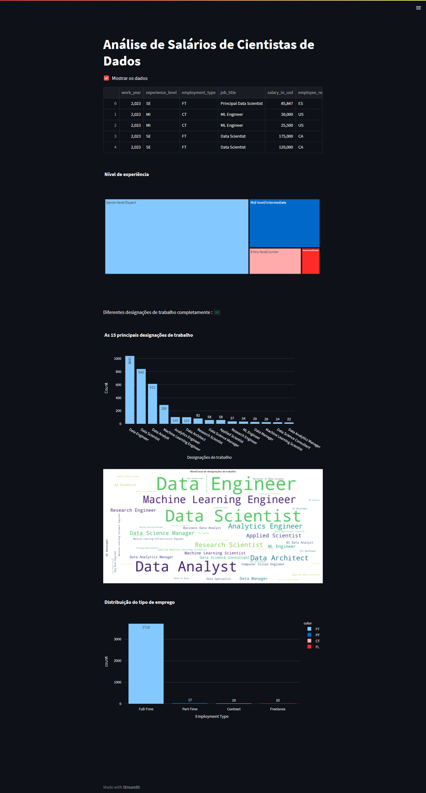

# Salários de Cientistas de Dados: Análise Exploratória

Este é um código em Python que utiliza a biblioteca Streamlit para criar uma aplicação web que realiza uma análise exploratória de dados sobre salários de cientistas de dados.

 

## Bibliotecas Utilizadas

 

- pandas: para manipulação de dados

- numpy: para cálculos matemáticos

- country_converter: para converter nomes de países

- matplotlib e seaborn: para visualização de dados

- plotly: para criação de gráficos interativos

- wordcloud: para criação de nuvens de palavras

- nltk: para cálculo de frequência de palavras

 

## Funcionalidades da Aplicação

 

- Checkbox para mostrar os dados

- Gráfico de treemap para mostrar a distribuição dos níveis de experiência

- Gráfico de barras para mostrar as 15 principais designações de trabalho

- Wordcloud para exibir as palavras mais frequentes nas designações de trabalho

- Gráfico de barras para mostrar a distribuição do tipo de emprego

 

## Funções

 

- Freq_df: utiliza a biblioteca NLTK para calcular a frequência das palavras e retorna um dataframe com as palavras e suas frequências.

- Word_Cloud: utiliza a biblioteca wordcloud para criar o wordcloud a partir dos dados fornecidos.

 

Em geral, o código é bem estruturado e fácil de entender. Ele fornece uma boa base para uma análise mais detalhada dos salários de cientistas de dados.

 
 

